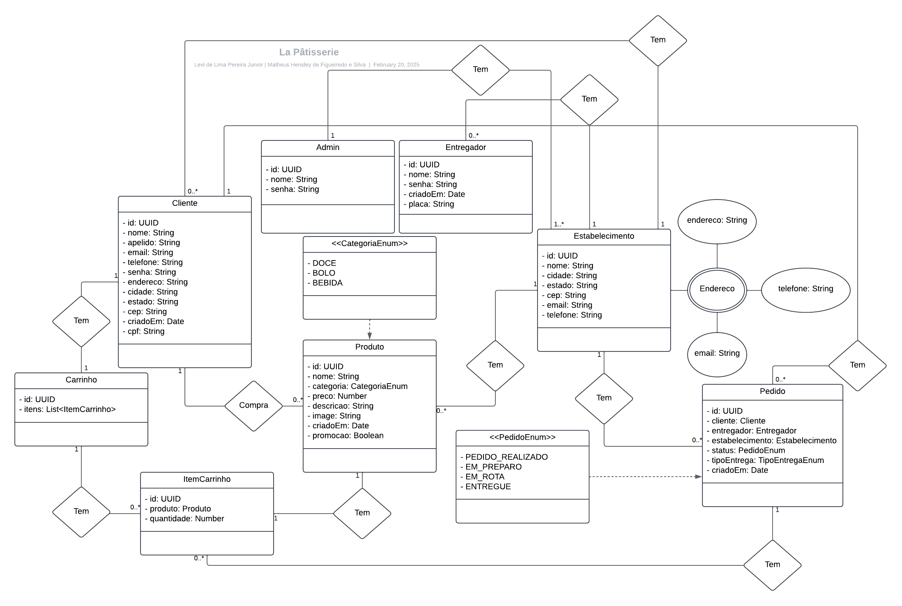

# La Pâtisserie

**La Pâtisserie de Campina Grande** agora também tem uma aplicação web completa para facilitar o acesso aos seus deliciosos produtos e serviços, oferecendo uma experiência de compra online inovadora e prática. Com um site moderno e responsivo, desenvolvido com tecnologias de ponta, a loja agora está mais acessível do que nunca, permitindo que os clientes façam pedidos, conheçam os produtos e personalizem suas encomendas de forma simples e rápida.

## Design e Funcionalidade
A interface do site é cuidadosamente projetada para refletir a elegância e o charme da marca, com uma estética que remete à sofisticação francesa. Utilizando as melhores práticas de desenvolvimento front-end, o site é 100% responsivo, garantindo uma navegação fluida em desktops, tablets e smartphones.

Ao acessar o site da La Pâtisserie, os visitantes são imediatamente recebidos por uma homepage encantadora, com imagens de alta qualidade dos produtos mais populares, como o "Gâteau de Fête" e os irresistíveis "Macaron de Paris". A navegação é intuitiva, com menus organizados para que os clientes encontrem rapidamente o que procuram — seja bolos, doces, salgados ou uma combinação dos dois.

## Funcionalidades do Site
- 1. Catálogo de Produtos: O site conta com uma seção de catálogo onde todos os produtos da loja estão listados, com fotos detalhadas, descrições em francês e preços. É possível ver, por exemplo, os detalhes do "Brigadeiro au Cacao" ou o "Croquette au Poulet", e adicionar diretamente ao carrinho de compras. Cada produto vem com uma opção de personalização, onde o cliente pode escolher sabores, tamanhos e outros detalhes, como o tipo de decoração para bolos ou o recheio dos brigadeiros.

- 2. Pedidos Online: O sistema de pedidos online é integrado com um back-end eficiente, permitindo que os clientes façam encomendas para festas, aniversários e outros eventos diretamente pelo site. O cliente pode escolher a data de entrega, adicionar notas especiais sobre o pedido e até solicitar uma entrega para uma localização específica. Além disso, também é possível recolher o pedido no local.

- 3. Informações e Blog: A loja também possui uma seção de blog com dicas e sugestões para festas, incluindo receitas exclusivas, como o passo a passo para fazer um "Tarte Tatin" perfeito ou como montar a mesa de doces com "Macaron de Paris". Além disso, há uma seção de FAQ com as dúvidas mais frequentes, como prazos de entrega, políticas de devolução e orientações sobre como armazenar corretamente os produtos.

- 4. Localização e Contato: Para quem deseja visitar uma das lojas físicas em Campina Grande, o site oferece uma seção de localização, com mapa interativo e informações de contato, como telefone e horário de funcionamento. Há também uma opção para agendamento de visita, onde os clientes podem marcar um horário para um atendimento personalizado, ideal para quem está planejando um evento especial.

## Tecnologia do Site
O site foi desenvolvido utilizando as melhores ferramentas de front-end e back-end, como:

- Front-end: O site é construído com React.js, garantindo uma experiência de usuário rápida e dinâmica. Com o uso de CSS Grid e Flexbox, o layout se adapta perfeitamente a diferentes tamanhos de tela, proporcionando uma navegação sem interrupções.
- Back-end: O back-end da aplicação foi desenvolvido com Node.js e Express, garantindo que os pedidos sejam processados de forma rápida e eficiente. O banco de dados é o PostgreSQL, permitindo uma organização otimizada das informações de pedidos, clientes e produtos.

## Benefícios para os Clientes

- Facilidade de Acesso: O site proporciona um acesso fácil e rápido aos produtos, com uma experiência de compra online sem frustrações.
- Entrega Rápida: Os clientes podem agendar entregas para o dia e horário desejado, garantindo que o pedido chegue no momento perfeito.
- Suporte ao Cliente: Uma equipe de atendimento está disponível para ajudar com dúvidas e personalizações via chat ao vivo, telefone ou e-mail.
Com o site da La Pâtisserie, a experiência de saborear os produtos franceses da confeitaria se torna ainda mais prática e agradável, garantindo que cada evento e celebração seja marcado por sabores irresistíveis e memoráveis.


## Diagrama 



## Como executar o projeto

Siga os passos abaixo para configurar e executar o projeto:

### 1. Instalar as dependências
Execute o comando abaixo no terminal, na raiz do projeto:

```bash
npm install
```

### 2. Este projeto utiliza [Prisma](https://www.prisma.io/) para gerenciamento do banco de dados e requer uma versão do Node.js superior a 16.

## Pré-requisitos do Prisma

- **Node.js**: Certifique-se de ter uma versão superior a 16 instalada. Você pode gerenciar versões do Node.js usando o [nvm](https://github.com/nvm-sh/nvm).
- **npm**: Instalado junto com o Node.js.
- **PostgreSQL**

- Execute o comando abaixo no terminal, na raiz do projeto

```bash
nvm use 16
```

### PostgreSQL

- Execute o comando abaixo no terminal

```
psql -U postgres -h localhost
```

- Após isso, execute o próximo comando para criar o usuário

```
CREATE USER admin WITH PASSWORD 'admin';
```

Lembre-se de garantir que o usuário tenha permissão para criar banco de dados.

### Criar as migrations

- Execute o comando abaixo no terminal, na raiz do projeto

```bash
npx prisma migrate dev
```

- E dê um nome qualquer (pode ser o nome do model que você criou ou alterou) para a migration.

### Executar a aplicação

- Execute o comando abaixo no terminal, na raiz do projeto

```bash
npm run dev
```
